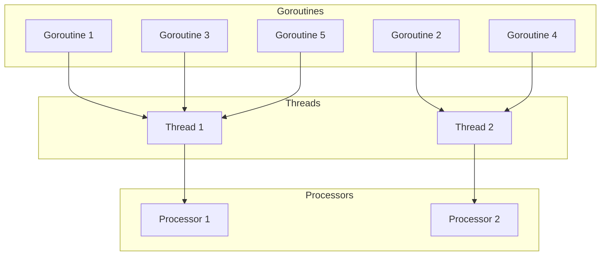

# How to Goroutines  
Este repositório foi criado para ajudar desenvolvedores a entender e aplicar goroutines de forma eficaz, auxiliando no desenvolvimento de aplicações concorrentes e evitando armadilhas comuns.

## Conteúdo

1. [Introdução](#introdução) 
2. [O que são goroutines](#o-que-são-goroutines)
3. [Criando goroutines](#criando-goroutines)
## Introdução

Antes de adentrarmos no assunto de goroutines, é importante entendermos a diferença entre **[[concorrência]]** e **[[paralelismo]]**, haja vista que concorrência é um aspecto fundamental da linguagem **[[Golang]]** que permite que os desenvolvedores escreva aplicações que realizam múltiplas tarefas concorrentemente.

Concorrência e paralelismo são termos comumente usados para descrever a execução de múltiplas tarefas. Mas, apesar de às vezes serem confudidos como a mesma coisa, eles não são, pois representam formas diferentes de como as tarefas são gerenciadas e executadas.

**Concorrencia**: é a capacidade de um programar lidar com múltiplas tarefas aparentemente ao mesmo tempo, mesmo que a execução dependa da troca rápida entres as tarefas permitindo que o sistema progrida em diversas tarefas sem esperar que uma termine completamente antes de iniciar a outra. 

A **analogia** clássica para explicar esse conceito é a de imaginar um garçom em um restaurante. Ele precisa atender diversos clientes, pegar os pedidos, servir as bebidas, servir os pratos, receber o pagamento e até fazer coisas pelas quais, às vezes, ele nem é pago para fazer kkkk. Agora, imagina se ele tivesse que parar e esperar completar todo o ciclo de atendimento de um cliente para começar a atender o próximo. A espera seria longa e o restaurante provavelmente iria falir. Ao invés disso, ele alterna rapidamente entre cada cliente, realizando a atividade necessária que aquele cliente depende naquele momento. Assim, criando a ilusão de que está atendendo todos simultaneamente, mesmo que ele dedique apenas alguns minutos a cada cliente por vez.

**Paralelismo**: é a capacidade de executar múltiplas tarefas **simultaneamente** distribuindo-as entre múltiplas entidades capaz de realizar as tarefas, como os núcleos de um processador.

O paralelismo busca progresso simultâneo verdadeiro, utilizando os recursos de hardware disponíveis para executar diferentes partes do código exatamente ao mesmo tempo.

Vamos usar outra **analogia** para entender esse conceito: Pense numa casa que precisa ser pintada com urgência. Se o dono da casa tiver apenas um pintor, ele terá que pintar uma parede de cada vez. Mas, se houver vários pintores, cada um pintando uma parede diferente ao mesmo tempo, o tempo para finalizar a tarefa será menor, porque todos estão trabalhando simultaneamente para completar a tarefa.

**Tá, mas se a linguagem Golang foi criada recentemente e já existiam processadores multi-cores, porque os criadores optaram usar concorrência ao invés de paralelismo?**

Os criadores do Go adotaram a filosofia do [*Communicating Sequential Processes* (CSP)](https://medium.com/@richardlayte/go-concurrency-and-starbucks-5aa03303655f), onde você cria sua aplicação utilizando diversas [[goroutines]] que trocam mensagens entre si utilizando canais. Assim, você, como programador, não precisa se preocupar em alocar cada tarefa a um núcleo do processador, basta descrever _o que_ cada parte do programa faz e como elas se comunicam. O runtime do Go cuida de mapear essas goroutines e se o seu computador tiver mais de um núcleo disponível, a linguagem irá executá-las em paralelo; se for um processador single‑core, ele faz o revezamento delas de forma rápida (concorrência).
## O que são goroutines

Goroutines são funções leves (nesse cenário, leve significa que elas necessitam de ~2KB de memoria para serem criadas e crescem/diminuem dinamicamente conforme a necessidade. [Fonte](https://github.com/golang/go/blob/2cde950049dd46cae3ae91cde3e270825793ba0f/src/runtime/stack.go#L75-L80)) que são executadas de forma concorrente, gerenciadas pelo runtime do Go. As goroutines fornecem um mecanismo de alto nível para estruturar aplicações de maneira concorrente, abstraindo a complexidade associadas às threads tradicionalmente usada por outras linguagens e sendo gerenciadas pelo próprio runtime do Go, que decide quando, como e quanto de recurso computacional elas precisam para serem executadas.

Como comentei na introdução, golang suporta a execução de tarefas de forma paralela ao distribuir as goroutines entre os núcos de CPU disponíveis. O quão paralelo a aplicação pode ser é configurável usando a função `runtime.GOMAXPROCS(n)`, que define o número máximo de threads do sistema operacional que podem executar código Go. Observação: o padrão geralmente é o número de núcleos da máquina que está execuando o código.

Uma breve explicação sobre como funciona o runtime:  o runtime da linguagem possui um `scheduler` que basicamente é o responsável por distribuir as goroutines prontas para execução entre as threads do sistema operacional, que são destinadas a serem executadas nos núcleos da CPU do computador. Quando você define `runtime.GOMAXPROCS(n)` para um valor maior que 1, você está permitindo que o Go utilize múltiplo núcleos para executar as goroutines paralelamente.

Um coisa interessante a ser observar é que todas as instâncias de paralelismo são também formas de concorrência, pois se várias coisas estão acontecendo ao mesmo tempo, elas também estão sendo gerenciadas simultaneamente. No entanto, o inverso não é necessariamente verdadeiro; um programa concorrente pode não alcançar o paralelismo se estiver sendo executado em um processador com um único núcleo. Nesse caso, as tarefas seriam apenas intercaladas, simulando a simultaneidade, mas sem a execução paralela real.

**Tá, mas o runtime sabe que uma goroutine está pronta para ser executada?**

O runtime do Go gerencia o ciclo de vida das goroutines através de um scheduler que monitora seu estado em tempo real. As goroutines podem estar em três estados que são: 

* **Runnable**: A goroutine está pronta para ser executada, mas ainda não está em nenhuma thread.
* **Running**: A goroutine está sendo executada em uma thread do sistema.
* **Blocked**: A goroutine está temporariamente parada, esperando por algum evento externo. Isso pode incluir esperar por uma operação de I/O (ex: ler um arquivo, fazer uma requisição de rede) esperar por um lock (mutex) ser liberado ou esperar por dados serem enviados ou recebidos através de um canal
* **Terminated**: A goroutine completou sua execução ou foi finalizada devido à terminação da goroutine principal.

E o schedule identifica que uma goroutine está pronta para execução através dos seguintes mecanismos:

* **Eventos de desbloqueio**: Quando uma goroutine bloqueada por uma operação (ex: espera por um canal ou dormindo em um `Time.Sleep()`)  é desbloqueada, o runtime é notificado e move a goroutine para a fila de _runnable_.

*  **Integração com o sistema operacional**: Para operações de I/O (ex: leitura dados de um arquivo ou obter resposta de uma rede) o runtime utiliza um network poller para monitorar os eventos e quando um recurso I/O fica disponível, o poller notifica o runtime e assim a coloca na fila de _runnable_.

* **Filas de prontas**: As goroutines são organizadas em filas locais (uma por processador lógico) e uma fila global. Quando uma goroutine é criada ou desbloqueada, ela é adicionada a uma dessas filas, sinalizando assim o scheduler da sua disponibilidade.

**Tá, mas como o runtime sabe em qual núcleo do processador deve rodar a goroutine para garantir o uso eficiente dos recursos da máquina?**

A distribuição de _goroutines_ entre os núcleos do processador é feita indiretamente pelo scheduler do Go, que utiliza uma estratégia de agendamento **M:N** onde `M` goroutines são distribuídas em `N` threads do sistema operacional. Cada thread `M` é associada a um processador lógico `P`, que mantém uma fila local de goroutines prontas.



* **Processadores Lógicos (Ps):** O número de Ps é definido por `GOMAXPROCS`. Cada P possui uma fila local de goroutines prontas e está associado a uma thread do sistema operacional (**M**). Os Ps são a unidade central de escalonamento.

* **Work-Stealing:** Se um P fica sem goroutines em sua fila local, ele "rouba" metade das goroutines da fila de outro P ocupado ou busca da fila global. Isso equilibra a carga entre núcleos, evitando ociosidade.

* **Threads do Sistema (Ms):** As Ms são threads do sistema operacional gerenciadas pelo Go. O runtime limita o número de Ms ativas para evitar sobrecarga (normalmente até `GOMAXPROCS`). O sistema operacional escalona as Ms nos núcleos da CPU, mas o Go otimiza a distribuição de trabalho entre elas.

* **Tratamento de Bloqueios:** Se uma goroutine bloqueia (ex: syscall), o P se desvincula temporariamente da M bloqueada e busca uma M ociosa (ou cria uma nova) para continuar executando outras goroutines. Isso mantém os Ps ativos mesmo durante operações bloqueantes.

* **Integração com o Escalonador do Sistema Operacional:** Embora o Go não controle diretamente qual núcleo executa uma thread, o uso eficiente de Ps e o work-stealing garantem que as Ms sejam distribuídas de forma a maximizar o paralelismo. O sistema operacional, por sua vez, atribui as Ms aos núcleos disponíveis.    
## Criando goroutines

Para criar uma _goroutine_, basta usar a palavra reservada  `go`, seguida por uma chamada de função.

Por exemplo, você pode declarar uma _goroutine_ usando `go printMessage("Hello from a goroutine")`. Isso fará com que a função `printMessage` seja executada de maneira concorrente ao restante do código.

Dê uma olhada num exemplo bem básico:
```go
package main

import (
	"fmt"
	"time"
)

func printMessage(msg string) {
	fmt.Println(msg)
}

func main() {
	fmt.Println("Hello world from the main function")
	go printMessage("Hello from a goroutine")
	fmt.Println("After create a goroutine")
}
```

No código acima, a função `main` é a porta de entrada do programa. Ela começa imprimindo `Hello world from the main function`, cria a _goroutine_ com a função `printMessage` e, imediatamente, continua a execução, imprimindo `After create a goroutine`.

Você pode rodar o snippet de código acima no [Go Playground](https://go.dev/play/) e perceber que tem um pequeno problema. A mensagem da _goroutine_ não é exibida no terminal.

**Oxi, mas por quê se eu criei a goroutine? Por que a mensagem não apareceu?**
Isso acontece porque, ao ser criada, a _goroutine_ é agendada (pelo `scheduler` do runtime) e isso não significa que ela será executada imediatamente.
Além disso, quando a função `main` termina, todo o programa é encerrado, mesmo que ainda existam _goroutines_ aguardando para serem executadas ou em andamento.

**Ok, então como garanto que a goroutine seja executada?**
A maneira mais prática de garantir isso é adicionando um `time.Sleep` ao final da função `main`. Isso dará tempo suficiente para que o _runtime_ possa agendar e executar a _goroutine_ antes de encerrar o código. 

Adicionando a pausa, o código fica assim:
```go
package main

import (
	"fmt"
	"time"
)

func printMessage(msg string) {
	fmt.Println(msg)
}

func main() {
	fmt.Println("Hello world from the main function")
	go printMessage("Hello from a goroutine")
	fmt.Println("After create a goroutine")
	time.Sleep(1 * time.Second)
}
```

A saída esperada agora é: 
```
Hello world from main function
After a goroutine 
Hello from a goroutine
```

Agora sim, o código funcionou como o esperado.

**Mas será que faz sentido ficar colocando `time.Sleep` dentro do seu código de produção?**
A resposta é: **não, não faz sentido.** Essa é apenas uma solução didática e você não deve fazer isso em código de produção. 
Em aplicações reais, o go oferece mecanismos mais apropriados para lidar com esse problema.

2. [Sincronização de Goroutines](#sincronizacao-de-goroutines)  
   4.1. `sync.WaitGroup`  
   4.2. `sync.Mutex` e `sync.RWMutex`  
   4.3. `sync.Once`  
3. [Comunicação com Channels](#comunicacao-com-channels)  
   5.1. Criando channels (`chan T`)  
   5.2. Envio e recebimento (`<-`)  
   5.3. Buffered vs. unbuffered channels  
   5.4. Fechando channels (`close`)  
4. [`select` e multiplexação de canais](#select-e-multiplexacao-de-canais)  
   6.1. Caso padrão (`default`)  
   6.2. Timeout com `time.After`  
   6.3. `select` em loops  
5. [Contextos e cancelamento](#contextos-e-cancelamento)  
   7.1. `context.Context`  
   7.2. Propagando cancelamento  
   7.3. Prazos (`WithTimeout`, `WithDeadline`)  
6. [Modelos de concorrência comuns](#modelos-de-concorrencia-comuns)  
   8.1. Worker pool  
   8.2. Fan-in / Fan-out  
   8.3. Pipeline  
7. [Tratamento de erros em Goroutines](#tratamento-de-erros-em-goroutines)  
   9.1. `error` e `panic`  
   9.2. Recuperação (`recover`)  
   9.3. Padrões de comunicação de erro via channels  
8. [Profiling e diagnóstico](#profiling-e-diagnostico)  
    10.1. `pprof`  
    10.2. `runtime.NumGoroutine`  
    10.3. Detectando deadlocks  
9. [Boas práticas e armadilhas comuns](#boas-praticas-e-armadilhas-comuns)  
    11.1. Evitar vazamentos de goroutine  
    11.2. Cautela com channels não lidos  
    11.3. Sincronização mínima necessária  
10. [Comparação de workloads CPU-bound vs I/O-bound](#comparacao-de-workloads-cpu-bound-vs-io-bound)  
11. [REFS](#refs)  
12. [TO-DO / Conceitos avançados](#to-do--conceitos-avancados)  
    - Pool de conexões  
    - Scheduler interno do Go  
    - Goroutines M:N