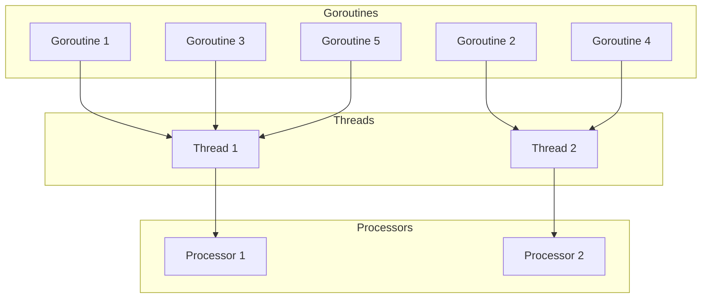
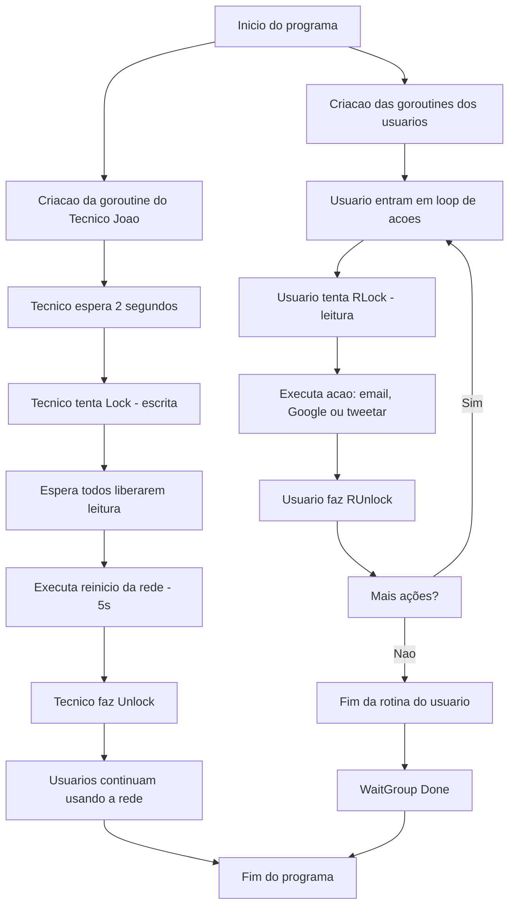

# How to Goroutines  
Este repositório foi criado para ajudar desenvolvedores a entender e aplicar goroutines de forma eficaz, auxiliando no desenvolvimento de aplicações concorrentes e evitando armadilhas comuns.

## Conteúdo

1. [Introdução](#introdução) 
2. [O que são goroutines](#o-que-são-goroutines)
3. [Criando goroutines](#criando-goroutines)
4. [Sincronização de goroutines](#sincronização-de-goroutines)
## Introdução

Antes de adentrarmos no assunto de goroutines, é importante entendermos a diferença entre **concorrência** e **paralelismo**, haja vista que concorrência é um aspecto fundamental da linguagem  que permite que os desenvolvedores escrevam aplicações que realizam múltiplas tarefas concorrentemente.

_**Concorrência** e **paralelismo**_ são termos comumente usados para descrever a execução de múltiplas tarefas. Mas, apesar de às vezes serem confudidos como a mesma coisa, eles não são. Na verdade, eles representam formas diferentes de como tarefas são gerenciadas e executadas.

**Concorrencia**: é a capacidade de um programar lidar com múltiplas tarefas aparentemente ao mesmo tempo, mesmo que a execução dependa da troca rápida entres as tarefas permitindo que o sistema progrida em diversas tarefas sem esperar que uma termine completamente antes de iniciar a outra. 

A **analogia** clássica para explicar esse conceito é a de imaginar um garçom em um restaurante. Ele precisa atender diversos clientes, pegar os pedidos, servir as bebidas, servir os pratos, receber o pagamento e até fazer coisas pelas quais, às vezes, ele nem é pago para fazer kkkk. Agora, imagina se ele tivesse que parar e esperar completar todo o ciclo de atendimento de um cliente para começar a atender o próximo. A espera seria longa e o restaurante provavelmente iria falir. Ao invés disso, ele alterna rapidamente entre cada cliente, realizando a atividade necessária que aquele cliente depende naquele momento. Assim, criando a ilusão de que está atendendo todos simultaneamente, mesmo que ele dedique apenas alguns minutos a cada cliente por vez.

**Paralelismo**: é a capacidade de executar múltiplas tarefas **simultaneamente** distribuindo-as entre múltiplas entidades capazes de realizar as tarefas, como os núcleos de um processador.

O paralelismo busca progresso simultâneo verdadeiro, utilizando os recursos de hardware disponíveis para executar diferentes partes do código exatamente ao mesmo tempo.

Uma **analogia** para entender esse conceito: Pense numa casa que precisa ser pintada com urgência. Se o dono da casa tiver apenas um pintor, ele terá que pintar uma parede de cada vez. Mas, se houver vários pintores, cada um pintando uma parede diferente ao mesmo tempo, o tempo para finalizar a tarefa será menor, porque todos estão trabalhando simultaneamente para completar a tarefa.

**Tá, mas se a linguagem Golang foi criada recentemente e já existiam processadores multi-cores, porque os criadores optaram usar concorrência ao invés de paralelismo?**

Os criadores do Go adotaram a filosofia do [*Communicating Sequential Processes* (CSP)](https://medium.com/@richardlayte/go-concurrency-and-starbucks-5aa03303655f), onde você cria sua aplicação utilizando diversas goroutines que trocam mensagens entre si utilizando canais. Assim, você, como programador, não precisa se preocupar em alocar cada tarefa a um núcleo do processador, basta descrever _o que_ cada parte do programa faz e como elas se comunicam. O runtime do Go cuida de mapear essas goroutines e se o seu computador tiver mais de um núcleo disponível, a linguagem irá executá-las em paralelo; se for um processador single‑core, ele faz o revezamento delas de forma rápida (concorrência).
## O que são goroutines

Goroutines são funções leves (nesse cenário, leve significa que elas necessitam de ~2KB de memoria para serem criadas e crescem/diminuem dinamicamente conforme a necessidade. [Fonte](https://github.com/golang/go/blob/2cde950049dd46cae3ae91cde3e270825793ba0f/src/runtime/stack.go#L75-L80)) que são executadas de forma concorrente, gerenciadas pelo runtime do Go. As goroutines fornecem um mecanismo de alto nível para estruturar aplicações de maneira concorrente, abstraindo a complexidade associadas às threads tradicionalmente usada por outras linguagens e sendo gerenciadas pelo próprio runtime do Go, que decide quando, como e quanto de recurso computacional elas precisam para serem executadas.

Como comentei na introdução, golang suporta a execução de tarefas de forma paralela ao distribuir as goroutines entre os núcos de CPU disponíveis. O quão paralelo a aplicação pode ser é configurável usando a função `runtime.GOMAXPROCS(n)`, que define o número máximo de threads do sistema operacional que podem executar código Go. Observação: o padrão geralmente é o número de núcleos da máquina que está execuando o código.

Uma breve explicação sobre como funciona o runtime:  o runtime da linguagem possui um `scheduler` que basicamente é o responsável por distribuir as goroutines prontas para execução entre as threads do sistema operacional, que são destinadas a serem executadas nos núcleos da CPU do computador. Quando você define `runtime.GOMAXPROCS(n)` para um valor maior que 1, você está permitindo que o Go utilize múltiplo núcleos para executar as goroutines paralelamente.

Um coisa interessante a ser observar é que todas as instâncias de paralelismo são também formas de concorrência, pois se várias coisas estão acontecendo ao mesmo tempo, elas também estão sendo gerenciadas simultaneamente. No entanto, o inverso não é necessariamente verdadeiro; um programa concorrente pode não alcançar o paralelismo se estiver sendo executado em um processador com um único núcleo. Nesse caso, as tarefas seriam apenas intercaladas, simulando a simultaneidade, mas sem a execução paralela real.

**Tá, mas o runtime sabe que uma goroutine está pronta para ser executada?**

O runtime do Go gerencia o ciclo de vida das goroutines através de um scheduler que monitora seu estado em tempo real. As goroutines podem estar em três estados que são: 

* **Runnable**: A goroutine está pronta para ser executada, mas ainda não está em nenhuma thread.
* **Running**: A goroutine está sendo executada em uma thread do sistema.
* **Blocked**: A goroutine está temporariamente parada, esperando por algum evento externo. Isso pode incluir esperar por uma operação de I/O (ex: ler um arquivo, fazer uma requisição de rede) esperar por um lock (mutex) ser liberado ou esperar por dados serem enviados ou recebidos através de um canal
* **Terminated**: A goroutine completou sua execução ou foi finalizada devido à terminação da goroutine principal.

E o schedule identifica que uma goroutine está pronta para execução através dos seguintes mecanismos:

* **Eventos de desbloqueio**: Quando uma goroutine bloqueada por uma operação (ex: espera por um canal ou dormindo em um `Time.Sleep()`)  é desbloqueada, o runtime é notificado e move a goroutine para a fila de _runnable_.

*  **Integração com o sistema operacional**: Para operações de I/O (ex: leitura dados de um arquivo ou obter resposta de uma rede) o runtime utiliza um network poller para monitorar os eventos e quando um recurso I/O fica disponível, o poller notifica o runtime e assim a coloca na fila de _runnable_.

* **Filas de prontas**: As goroutines são organizadas em filas locais (uma por processador lógico) e uma fila global. Quando uma goroutine é criada ou desbloqueada, ela é adicionada a uma dessas filas, sinalizando assim o scheduler da sua disponibilidade.

**Tá, mas como o runtime sabe em qual núcleo do processador deve rodar a goroutine para garantir o uso eficiente dos recursos da máquina?**

A distribuição de _goroutines_ entre os núcleos do processador é feita indiretamente pelo scheduler do Go, que utiliza uma estratégia de agendamento **M:N** onde `M` goroutines são distribuídas em `N` threads do sistema operacional. Cada thread `N` é associada a um processador lógico `P`, que mantém uma fila local de goroutines prontas.



* **Processadores Lógicos (Ps):** O número de Ps é definido por `GOMAXPROCS`. Cada P possui uma fila local de goroutines prontas e está associado a uma thread do sistema operacional (**M**). Os Ps são a unidade central de escalonamento.

* **Work-Stealing:** Se um P fica sem goroutines em sua fila local, ele "rouba" metade das goroutines da fila de outro P ocupado ou busca da fila global. Isso equilibra a carga entre núcleos, evitando ociosidade.

* **Threads do Sistema (Ms):** As Ms são threads do sistema operacional gerenciadas pelo Go. O runtime limita o número de Ms ativas para evitar sobrecarga (normalmente até `GOMAXPROCS`). O sistema operacional escalona as Ms nos núcleos da CPU, mas o Go otimiza a distribuição de trabalho entre elas.

* **Tratamento de Bloqueios:** Se uma goroutine bloqueia (ex: syscall), o P se desvincula temporariamente da M bloqueada e busca uma M ociosa (ou cria uma nova) para continuar executando outras goroutines. Isso mantém os Ps ativos mesmo durante operações bloqueantes.

* **Integração com o Escalonador do Sistema Operacional:** Embora o Go não controle diretamente qual núcleo executa uma thread, o uso eficiente de Ps e o work-stealing garantem que as Ms sejam distribuídas de forma a maximizar o paralelismo. O sistema operacional, por sua vez, atribui as Ms aos núcleos disponíveis.    
## Criando goroutines

Para criar uma _goroutine_, basta usar a palavra reservada  `go`, seguida por uma chamada de função.

Por exemplo, você pode declarar uma _goroutine_ usando `go printMessage("Hello from a goroutine")`. Isso fará com que a função `printMessage` seja executada de maneira concorrente ao restante do código.

Dê uma olhada nesse exemplo básico:
```go
package main

import (
	"fmt"
	"time"
)

func printMessage(msg string) {
	fmt.Println(msg)
}

func main() {
	fmt.Println("Hello world from the main function")
	go printMessage("Hello from a goroutine")
	fmt.Println("After create a goroutine")
}
```

No código acima, a função `main` é a porta de entrada do programa. Ela começa imprimindo `Hello world from the main function`, cria a _goroutine_ com a função `printMessage` e, imediatamente, continua a execução, imprimindo `After create a goroutine`.

Você pode rodar o snippet de código acima no [Go Playground](https://go.dev/play/) e perceber que tem um pequeno problema. A mensagem da _goroutine_ não é exibida no terminal.

**Oxi, mas por quê se eu criei a goroutine? Por que a mensagem não apareceu?**
Isso acontece porque, ao ser criada, a _goroutine_ é agendada (pelo `scheduler` do runtime) e isso não significa que ela será executada imediatamente.
Além disso, quando a função `main` termina, todo o programa é encerrado, mesmo que ainda existam _goroutines_ aguardando para serem executadas ou em andamento.

**Ok, então como garanto que a goroutine seja executada?**
A maneira mais prática de garantir isso é adicionando um `time.Sleep` ao final da função `main`. Isso dará tempo suficiente para que o _runtime_ possa agendar e executar a _goroutine_ antes de encerrar o código. 

Adicionando a pausa, o código fica assim:
```go
package main

import (
	"fmt"
	"time"
)

func printMessage(msg string) {
	fmt.Println(msg)
}

func main() {
	fmt.Println("Hello world from the main function")
	go printMessage("Hello from a goroutine")
	fmt.Println("After create a goroutine")
	time.Sleep(1 * time.Second)
}
```

A saída esperada agora é: 
```
Hello world from main function
After a goroutine 
Hello from a goroutine
```

Agora sim, o código funcionou como o esperado.

**Mas será que faz sentido ficar colocando `time.Sleep` dentro do seu código de produção?**
A resposta é: **não, não faz sentido.** Essa é apenas uma solução didática e você não deve fazer isso em código de produção. 
Em aplicações reais, o go oferece mecanismos mais apropriados para lidar com esse problema.

## Sincronização de goroutines

Como vimos anteriormente, não é interessante usar `time.Sleep` para fazer com que a goroutine seja executada. Se o tempo for muito curto, corre-se o risco da goroutine não ser executada. E se for muito longo, o programa ficará esperando desnecessariamente, desperdiçando tempo.

Pensando nisso, o Go fornece uma biblioteca chamada `sync`, que possui ferramentas específicas para lidar com a sincronização entre goroutines de forma eficiente.

### O `sync.WaitGroup`

O `sync.WaitGroup` é uma das ferramentas fornecidas pela biblioteca que permite que uma goroutine aguarde até que um conjunto de outras goroutines finalize sua execução. Basicamente, o que ele faz é manter um contador interno, que é incrementado quando uma nova goroutine é adicionada ao grupo e decrementado quando uma goroutine sinaliza que concluiu a tarefa.

Os métodos que utilizamos para realizar essas ações são:
* `Add(n)`: utilizado para incrementar o contador em `n`;
* `Done()`: utilizado para decrementar o contador em 1;
* `Wait()`: utilizado para bloquear a goroutine chamadora até que o contador chegue a zero, indicando que todas as goroutines adicionadas terminaram.

Exemplo de uso do `sync.WaitGroup` (lembrando que você pode usar o [playground](https://go.dev/play/) para testar o código abaixo):
```go
package main

import (
    "fmt"
    "sync"
)

func main() {
    var wg sync.WaitGroup

    for i := 1; i <= 3; i++ {
        wg.Add(1) // Adiciona 1 ao WaitGroup
        go func(id int) {
            defer wg.Done() // Decrementa o contador ao terminar
            fmt.Printf("Goroutine %d executando\n", id)
        }(i)
    }

    wg.Wait() // Espera todas as goroutines terminarem
    fmt.Println("Todas as goroutines concluíram")
}
```

Resultado esperado:
```
Goroutine 3 executando
Goroutine 1 executando
Goroutine 2 executando
Todas as goroutines concluíram
```

### O `sync.Mutex` e `sync.RWMutex`

O `sync.Mutex` e o `sync.RWMutex` são duas outras duas ferramentas do pacote `sync` que realizam tarefas muito parecidas e que podem até serem confudidas. No entanto, elas são utilizadas em contextos e cenários diferentes.
#### **O que é o `sync.Mutex` e para o que ele serve?**

O `sync.Mutex` é um método que tem em si um princípio simples: uma vez que uma goroutine adquire um `sync.Mutex`, nenhuma outra goroutine pode adquirir o mesmo mutex até que ele seja liberado pela goroutine que o bloqueou.
  
Fazendo uma **analogia** como o mundo real: o `sync.Mutex` funciona como a fechadura de um banheiro de bar. Quando uma pessoa entra e tranca a porta, ninguém mais pode entrar até que a pessoa destranque e assim fique disponível para outra pessoa utilizar.

Os métodos que utilizamos para realizar essas ações são:
* `Lock()`: utilizado para bloquear o mutex.
* `Unlock()`: utilizado para desbloquear o mutex.

Exemplo de uso do `sync.Mutex` (lembrando que você pode usar o [playground](https://go.dev/play/) para testar o código abaixo):
```go
package main

import (
	"fmt"
	"sync"
	"time"
)

var bathroom sync.Mutex // O mutex representa a fechadura do banheiro

// Função que simula uma pessoa usando o banheiro
func useBathroom(people int, wg *sync.WaitGroup) {
	defer wg.Done() // Sinaliza que a goroutine terminou ao final

	fmt.Printf("Pessoa %d está esperando para usar o banheiro.\n", people)

	bathroom.Lock() // Tranca a porta (adquire o mutex e impede que outras goroutines possam usá-lo e faz com que elas aguardem)
	fmt.Printf("Pessoa %d entrou no banheiro.\n", people)

	time.Sleep(2 * time.Second) // Simula o tempo fazendo pips

	fmt.Printf("Pessoa %d saiu do banheiro.\n", people)
	bathroom.Unlock() // Destranca a porta (libera o mutex para que outra goroutine possa usá-lo)
}

func main() {
	var wg sync.WaitGroup
	numOfPeople := 3

	wg.Add(numOfPeople)

	for i := 1; i <= numOfPeople; i++ {
		go useBathroom(i, &wg)
	}

	wg.Wait()
	fmt.Println("Todas as pessoas usaram o banheiro.")
}
```

Resultado esperado (PS: a ordem por ser diferente por causa do gerenciamento automático de goroutines do runtime):
```
Pessoa 3 está esperando para usar o banheiro.
Pessoa 3 entrou no banheiro.
Pessoa 2 está esperando para usar o banheiro.
Pessoa 1 está esperando para usar o banheiro.
Pessoa 3 saiu do banheiro.
Pessoa 2 entrou no banheiro.
Pessoa 2 saiu do banheiro.
Pessoa 1 entrou no banheiro.
Pessoa 1 saiu do banheiro.
Todas as pessoas usaram o banheiro.
```

#### **O que é o `sync.RWMutex` e para o que ele serve?**

O `sync.RWMutex`, diferentemente do `sync.Mutex`, é uma estrutura que não impede que outras goroutines fiquem travadas. Isso acontece porque ele oferece dois modos de bloqueio:
* `Leitura (RLock/RUnlock)`: utilizado para que muitos leitores possam acessar o dado, desde que não haja nenhum escritor alterando o valor do dado.
* `Escrita (Lock/Unlock)`: utilizado de modo exclusivo impedindo que nenhum leitor ou escritor acessem o dado até ser liberado.
Essa abordagem é ideal para quando você tem estruturas de dados ou recursos que são lidos frequentemente, mas escritos com pouca frequência, assim aumentando significativamente o desempenho maximizando as leituras sem comprometer a segurança durante os processos de escrita.

Fazendo uma **analogia** com o mundo real: Imagine que você está trabalhando no escritório da sua empresa e todos os funcionários dependem da mesma rede de internet para realizar suas tarefas.
Acessar o navegador para ler um email ou pesquisar no google são como acessos de leitura `(RLock/RUnlock)` e várias pessoas podem fazer isso ao mesmo tempo sem prejudicar umas às outras. 
Reiniciar o roteador para aplicar uma configuração na rede, por exemplo, são como acessos de escrita `Lock/Unlock` que faz com que a rede fique totalmente indisponível. Por isso, o técnico primeiro precisa que todos terminem suas tarefas (imagina cortar aquele upload em 99%) para poder fazer efetuar a configuração e após isso o técnico libera o acesso novamente.

```go
package main

import (
	"fmt"
	"math/rand"
	"sync"
	"time"
)

var (
	rwMutex sync.RWMutex
	wg      sync.WaitGroup
)

func log(name string, message string) {
	fmt.Printf("[%s] %s - %s\n", time.Now().Format("15:04:05"), name, message)
}

func userRoutine(name string) {
	defer wg.Done()
	for i := 0; i < 3; i++ {
		rwMutex.RLock()
		action := []string{"acessando o e-mail", "pesquisando no Google", "tweetando"}[rand.Intn(3)]
		log(name, fmt.Sprintf("está %s...", action))
		time.Sleep(time.Duration(rand.Intn(1000)+500) * time.Millisecond)
		log(name, fmt.Sprintf("terminou de %s.", action))
		rwMutex.RUnlock()

		time.Sleep(time.Duration(rand.Intn(1000)) * time.Millisecond)
	}
}

func restartNetwork(technician string) {
	defer wg.Done()
	time.Sleep(2 * time.Second)
	log(technician, "precisa reiniciar a rede! Aguardando todos terminarem...")
	rwMutex.Lock()
	log(technician, "está reiniciando a rede. Todos os acessos foram bloqueados.")
	time.Sleep(5 * time.Second)
	log(technician, "terminou de reiniciar a rede. Acesso liberado.")
	rwMutex.Unlock()
}

func main() {
	rand.Seed(time.Now().UnixNano())

	users := []string{"Alice", "Bruno", "Carla", "Diego", "Eduarda", "Felipe"}

	for _, name := range users {
		wg.Add(1)
		go userRoutine(name)
	}

	wg.Add(1)
	go restartNetwork("Técnico João")

	wg.Wait()
	fmt.Println("\nTodas as tarefas foram concluídas.")
}
```

Resultado esperado (PS: a ordem por ser diferente por causa do gerenciamento automático de goroutines do runtime): 
```
[23:00:00] Carla - está tweetando...
[23:00:00] Alice - está acessando o e-mail...
[23:00:00] Bruno - está acessando o e-mail...
[23:00:00] Diego - está acessando o e-mail...
[23:00:00] Eduarda - está acessando o e-mail...
[23:00:00] Felipe - está acessando o e-mail...
[23:00:00] Bruno - terminou de acessando o e-mail.
[23:00:00] Alice - terminou de acessando o e-mail.
[23:00:00] Alice - está tweetando...
[23:00:01] Carla - terminou de tweetando.
[23:00:01] Eduarda - terminou de acessando o e-mail.
[23:00:01] Felipe - terminou de acessando o e-mail.
[23:00:01] Diego - terminou de acessando o e-mail.
[23:00:01] Bruno - está acessando o e-mail...
[23:00:01] Felipe - está pesquisando no Google...
[23:00:01] Diego - está acessando o e-mail...
[23:00:01] Alice - terminou de tweetando.
[23:00:02] Técnico João - precisa reiniciar a rede! Aguardando todos terminarem...
[23:00:02] Felipe - terminou de pesquisando no Google.
[23:00:02] Diego - terminou de acessando o e-mail.
[23:00:02] Bruno - terminou de acessando o e-mail.
[23:00:02] Técnico João - está reiniciando a rede. Todos os acessos foram bloqueados.
[23:00:07] Técnico João - terminou de reiniciar a rede. Acesso liberado.
[23:00:07] Felipe - está pesquisando no Google...
[23:00:07] Eduarda - está pesquisando no Google...
[23:00:07] Alice - está tweetando...
[23:00:07] Carla - está pesquisando no Google...
[23:00:07] Diego - está acessando o e-mail...
[23:00:07] Bruno - está tweetando...
[23:00:08] Bruno - terminou de tweetando.
[23:00:08] Diego - terminou de acessando o e-mail.
[23:00:08] Carla - terminou de pesquisando no Google.
[23:00:08] Eduarda - terminou de pesquisando no Google.
[23:00:08] Felipe - terminou de pesquisando no Google.
[23:00:08] Eduarda - está pesquisando no Google...
[23:00:08] Alice - terminou de tweetando.
[23:00:09] Carla - está acessando o e-mail...
[23:00:09] Eduarda - terminou de pesquisando no Google.
[23:00:10] Carla - terminou de acessando o e-mail.
Todas as tarefas foram concluídas.
```



### O `sync.Once`
#### **O que é o `sync.Once` e para o que ele serve?**
O `sync.Once` é uma estrutura que, como diz o nome, garante que uma determinada função será executada apenas uma vez, mesmo que seja chamada múltiplas vezes por diferentes goroutines.
Ela serve muito bem para situações que precisam acontecer uma única vez dentro do ciclo de vida da aplicação, como:
* Configurar a conexão com o banco de dados
* Iniciar o logger
* Configurar o sistema de métricas

```go
package main

import (
	"fmt"
	"sync"
)

var once sync.Once

func main() {
	loopQuantity := 10

	var wg sync.WaitGroup // WaitGroup para aguardar a execução das goroutines
	wg.Add(loopQuantity)  // Informando que serão 10 goroutines

	for i := 0; i < loopQuantity; i++ {
		go func(i int) {
			defer wg.Done() // Marca essa goroutine como concluída no final

			fmt.Printf("Goroutine %d está tentando chamar o método once.Do\n", i)

			once.Do(func() {
				fmt.Printf("A função está rodando vindo da goroutine %d\n", i)
			})
		}(i)
	}

	wg.Wait() // Aguarda todas as goroutines terminarem
}
```

### Finalizando

Ok, agora entendemos como as ferramentas do pacote `sync` nos ajudam a controlar a execução e o acesso a recursos compartilhados entre goroutines da seguintes maneiras: 
* `sync.WaitGroup` permite esperar a conclusão de um grupo de goroutines. 
* `sync.Mutex` e `sync.RWMutex` garantem o acesso seguro a dados compartilhados.
* `sync.Once` assegura que uma inicialização seja feita apenas uma vez.

Mas agora vamos imaginar o cenário onde estamos escrevendo uma aplicação que possui N goroutines processando dados e precisamos que uma goroutine específica receba os resultados desses processamentos para enviar para algum lugar (ex: banco de dados, websocket, fila).
Utilizando apenas as ferramentas que vimos até agora, poderiamos usar uma variável compartilhada protegida por um Mutex. Mas isso poderia se tornar complexo, pouco manutenível e pouco escalável se tivermos várias goroutines alterando e consumindo essa variável, além de criar a necessidade de um controle de concorrência manual e potencialmente propenso a erros.

Para solucionar esse problema de forma mais segura e idiomática, o Go tem uma ferramenta chamada `channels` que permite a comunicação e a sincronização entre goroutines de uma maneira mais direta. Na próxima seção, irei explicar um pouco melhor sobre essa ferramenta e como ela funciona através de exemplos e analogias.
## O que são `channels`?

`Channels` são um tipo de dado em Go que permite realizar comunicação e a sincronização entre goroutines. 

A analogia clássica para entender esse conceito é de pensarmos em channels como se fossem tubulações pelas quais dados de um tipo específico podem trafegar entre uma goroutine e outra. Dessa maneira, os `channels` fornecem uma maneira segura e sincronizada para a comunicação, 
abstraindo a complexidade do compartilhamento de variáveis em memória que poderia levar a problemas comuns em programação concorrente como _`race conditions`_ e _`deadlock`_ que acontecem quando não são gerenciados de maneira cuidadosa. 
## Como criamos channels?

Os channels são criados usando a função built-in `make()`. Como citado anteriormente, os channels são tipados. Isso significa que precisamos especificar o tipo do dado que channel transportará.
Para isso usamos `ch := make(chan int)` para criar um `unbuffered channel` para transmitir valores inteiros e `ch := make(chan int, 5)` para criar um `buffered channel` que tem capacidade para armazenar até cinco valores inteiros.
## Comunicação entre channels (<-)

A comunicação entre channels é feitada usando um operador (esquisito) que é uma seta "<-".
Esse operador é utilizado tanto para enviar quanto para receber valores de um channel.

Um exemplo básico de como podemos realizar a comunicação entre duas goroutines:
```go
package main

import (
	"fmt"
	"sync"
	"time"
)

func sender(ch chan string, wg *sync.WaitGroup) {
	defer wg.Done()
	fmt.Println("Sender: Preparando mensagem...")
	time.Sleep(2 * time.Second)

	ch <- "Olá receiver!"
	fmt.Println("Sender: Mensagem entregue!")
}

func receiver(ch chan string, wg *sync.WaitGroup) {
	defer wg.Done()
	fmt.Println("Receiver: Pronto para receber!")

	msg := <-ch
	fmt.Println("Receiver:", msg)
}

func main() {
	var wg sync.WaitGroup
	wg.Add(2)

	ch := make(chan string)

	go sender(ch, &wg)
	go receiver(ch, &wg)

	wg.Wait()
}
```

Resultado esperado:
```go
Receiver: Pronto para receber!
Sender: Preparando mensagem...
Sender: Mensagem entregue!
Receiver: Olá receiver!
```
## Diferença entre `unbuffered channels` e `buffered channels`
#### `Unbuffered Channels` (Canais sem buffer)

`Unbuffered Channels` são canais de comunicação síncrona que funcionam como um ponto de encontro entre goroutines. Esse canais não possuem a capacidade de armazenar dados, isso significa que quando uma goroutine tenta enviar um valor, ela **trava** a execução até que outra goroutine esteja pronta para receber o valor. O inverso também acontece, ou seja, se uma goroutine tenta receber um valor, ela ficará bloqueada até que outra goroutine envie um valor nesse canal.

Podemos utilizar o código acima para exemplificar um canal sem buffer
#### `Buffered Channels` (Canais com buffer)

`Buffered Channels` são canais que permitem comunicação de forma **assíncrona** entre goroutines e podem **armazenar** uma quantidade específica de valores. Nesse caso, quando uma goroutine envia um valor, ela não trava imediatamente porque o valor é armazenado no buffer do canal. No entanto, precisamos pensar em dois cenários: 
* **O que acontece se o buffer estiver cheio?** 
	Se o buffer estiver cheio, a goroutine que envia ficará travada até que uma goroutine consuma um valor do buffer.
* **O que acontece se o buffer estiver vazio?**
	Se o buffer estiver vazio, a goroutine que recebe ficará travada até que uma goroutine envie um novo valor para o cannal.

Exemplo de canal com buffer:
```go
package main

import (
	"fmt"
	"sync"
	"time"
)

func sender(ch chan string, wg *sync.WaitGroup) {
	defer wg.Done()
	fmt.Println("[Sender] Iniciando envio de 4 mensagens (buffer=2)")

	messages := []string{
		"Mensagem 1",
		"Mensagem 2",
		"Mensagem 3",
		"Mensagem 4",
	}

	for _, msg := range messages {
		ch <- msg
		fmt.Printf("[Sender] Enviando: '%s'\n", msg)
		time.Sleep(500 * time.Millisecond)
	}
}

func receiver(ch chan string, wg *sync.WaitGroup) {
	defer wg.Done()

	time.Sleep(1000 * time.Millisecond)

	fmt.Println("\n[Receiver] Iniciando processamento")
	for i := 0; i < 4; i++ {
		fmt.Printf("[Receiver] Buffer agora: %d/%d\n", len(ch), cap(ch))
		msg := <-ch
		fmt.Printf("[Receiver] PROCESSANDO: '%s'\n", msg)
		time.Sleep(1500 * time.Millisecond)
	}
}

func main() {
	var wg sync.WaitGroup
	wg.Add(2)

	ch := make(chan string, 2)

	go sender(ch, &wg)
	go receiver(ch, &wg)

	wg.Wait()
}

```
O resultado esperado:
```go
[Sender] Iniciando envio de 4 mensagens (buffer=2)
[Sender] Enviando: 'Mensagem 1'
[Sender] Enviando: 'Mensagem 2'

[Receiver] Iniciando processamento
[Receiver] Buffer agora: 2/2
[Receiver] PROCESSANDO: 'Mensagem 1'
[Sender] Enviando: 'Mensagem 3'
[Receiver] Buffer agora: 2/2
[Receiver] PROCESSANDO: 'Mensagem 2'
[Sender] Enviando: 'Mensagem 4'
[Receiver] Buffer agora: 2/2
[Receiver] PROCESSANDO: 'Mensagem 3'
[Receiver] Buffer agora: 1/2
[Receiver] PROCESSANDO: 'Mensagem 4'
```

Percebemos, então, que apenas 2 das 4 mensagens foram enviadas inicialmente porque o buffer do canal é de apenas 2. Assim que enviamos as duas primeiras mensagens, o canal fica cheio e precisa que alguma goroutine consuma um valor para liberar espaço. Só então o _`sender`_ consegue enviar uma nova mensagem para o canal.
## Direcionalidade de channels

Em Go, a direcionalidade de channels permite restringir seu uso a três modos distintos: apenas para envio, apenas para recebimento ou para ambas as operações. A sintaxe para declarar cada uma dessas direcionalidades é a seguinte:

* **Somente envio:** `chan<- int`. Nesse caso, o channel só pode ser usado para enviar valores inteiros.
* **Somente recebimento:** `<-chan int`. Aqui, o channel só pode ser usado para receber valores inteiros.
* **Bidirecional:** `chan int`. Este tipo de channel permite tanto o envio quanto o recebimento de valores inteiros.

**Tá, mas porque a linguagem permite um channel ter direção? Quais as vantagens disso e em quais cenários isso pode ser usado?**

Adicionar direcionalidade aos channels aumenta a segurança porque dessa maneira o compilador Go garante que um channel seja utilizado estritamente para a finalidade definida em sua declaração. Ou seja, tentar enviar dados para um `<-chan int` ou receber dados de um `chan<- int` resultará em um erro, auxiliando significativamente na prevenção de erros.

Além disso, essa abordagem me faz lembrar do princípio do "zen of python" de que "explícito é melhor do que implícito", a direcionalidade em um channel torna explícita a intenção de como ele será usado. Dessa forma, ao analisar a declaração de uma função que recebe um channel como argumento, fica totalmente explicito se a função espera receber dados, enviar dados ou os dois.

**Exemplo:**
```go
func producer(dataOut chan<- int) {
    for i := 0; i < 10; i++ {
        dataOut <- i
        time.Sleep(time.Millisecond * 100)
    }
    close(dataOut)
}

func consumer(dataIn <-chan int) {
    for data := range dataIn {
        fmt.Println("Processando:", data)
    }
}

func main() {
    ch := make(chan int)
    go producer(ch)
    go consumer(ch)
    time.Sleep(time.Second * 2)
}
```
## Fechamento de `channels`

Para concluir o assunto, preciso falar sobre fechamento de channels. 
Fechamento de channels é um mecanismo para sinalizar os receptores que não haverá mais valores sendo enviados por um determinado channel. 

A sintaxe para fechar um channel é simples:

```go
close(myChannel)
```

Uma vez que um channel é fechado, as seguintes características se aplicam:

- **Envio em um channel fechado causa `panic`:** Tentar enviar um valor para um channel que já foi fechado causará `panic` na goroutine que tentar realizar esta ação. Sendo assim, é extremamente importante garantir que apenas o remetente feche o channel e que as tentativas de envio ocorram antes do fechamento.
- **Recepção em um channel fechado retorna o valor zero e `false`:** Quando um receptor tenta receber um valor de um channel fechado, a operação não bloqueia. Em vez disso, ela retorna o valor zero do tipo do channel (por exemplo, `0` para `int`, `""` para `string`, `nil` para ponteiros e interfaces) e um segundo valor do tipo `bool`, que será `false`. Esse segundo valor serve como um indicador de que o channel foi fechado e não há mais valores para receber.
- **Loop `range` em channels fechados termina:** Um loop `range` que itera sobre um channel continuará recebendo valores até que o channel seja fechado. Após o fechamento e o recebimento de todos os valores enfileirados, o loop `range` terminará graciosamente. Essa é uma forma idiomática de consumir todos os valores de um channel.

**Cenários de Uso Crucial para Fechar Channels:**

- **Produtores Finitos:** Quando uma goroutine produtora sabe que enviará um número finito de valores e depois terminará, fechar o channel sinaliza essa conclusão para os consumidores. O exemplo do `producer` na discussão sobre direcionalidade é um bom caso onde o `close(dataOut)` é essencial.
- **Comunicação de Término de Tarefa:** Em pipelines de processamento concorrente, fechar um channel pode indicar que um estágio específico do pipeline concluiu seu trabalho e não enviará mais resultados para o próximo estágio.

## Conhecendo o Select 

O  `select` é uma ferramenta utilizada para fluxo de controle que permite que uma goroutine espere por duas ou mais operações de channel. Essa ferramenta funciona de maneira muito parecida com o `switch` mas com a pequena diferença que ela é utilizada especificamente para channels em vez de variáveis e expressões.

O `select` trabalha de maneira que ele bloqueia a execução até que uma de seus `case` esteja pronto para ser executado. Deve-se levar em consideração que caso múltiplos `case` ficarem prontos ao mesmo tempo, um deles será escolhido de maneira aleatória para que seja executado.
Caso nenhum `case` fique pronto, o código pode ser direcionado para uma opção `default`. 

Exemplo para exibir a sintaxe e o uso do select

```go
package main

import (
	"fmt"
	"time"
)

func main() {
	// Cria dois canais
	canal1 := make(chan string)
	canal2 := make(chan string)

	// Inicia uma goroutine que envia uma mensagem para canal1 após 1 segundo
	go func() {
		time.Sleep(1 * time.Second)
		canal1 <- "Mensagem do canal 1"
	}()

	// Inicia uma goroutine que envia uma mensagem para canal2 após 2 segundos
	go func() {
		time.Sleep(2 * time.Second)
		canal2 <- "Mensagem do canal 2"
	}()

	// Usa a instrução select para esperar por mensagens de ambos os canais
	select {
	case msg1 := <-canal1:
		fmt.Println("Recebido do canal 1:", msg1)
	case msg2 := <-canal2:
		fmt.Println("Recebido do canal 2:", msg2)
	case <-time.After(3 * time.Second):
		fmt.Println("Nenhuma mensagem recebida dentro do tempo limite")
	}

	// Outro exemplo de select com um caso default
	canal3 := make(chan int)

	select {
	case msg3 := <-canal3:
		fmt.Println("Recebido do canal 3:", msg3)
	default:
		fmt.Println("Nenhuma mensagem disponível no canal 3")
	}
}
```

### Implementando timeout com `select`

Para implementar timeouts em operações de channel, utiliza-se a instrução `select` em conjunto com a função `time.After()`. Esta função retorna um channel que recebe um valor após a duração definida. Dentro do `select`, um `case` tenta executar a operação de channel desejada, enquanto um segundo `case` aguarda o sinal de timeout do `time.After()`. A primeira operação a ser concluída determina qual `case` será executado. Se o tempo limite expirar antes da conclusão da operação principal, o `case` de timeout é ativado, permitindo que o programa siga uma rota alternativa, como registrar o evento ou retornar um erro específico.

```go
package main

import (
	"fmt"
	"time"
)

func main() {
	fmt.Println("--- Cenário 1: Sucesso ---")
	resultChan1 := make(chan string)

	go func() {
		time.Sleep(1 * time.Second)
		resultChan1 <- "Operação 1 concluída com sucesso!"
	}()

	select {
	case res := <-resultChan1:
		fmt.Println("Recebido:", res)
	case <-time.After(2 * time.Second):
		fmt.Println("Timeout! A operação 1 demorou demais.")
	}

	fmt.Println("--------------------------------")


	fmt.Println("--- Cenário 2: Timeout ---")
	resultChan2 := make(chan string)
	
	go func() {
		time.Sleep(3 * time.Second)
		resultChan2 <- "Operação 2 concluída."
	}()

	select {
	case res := <-resultChan2:
		fmt.Println("Recebido:", res)
	case <-time.After(2 * time.Second):
		fmt.Println("Timeout! A operação 2 demorou demais.")
	}
}

```
### Select em loops

Usar `select` dentro de um laço `for` é a maneira mais comumente usada pela comunidade golang para lida com concorrencia porque permite que uma goroutine processe eventos de múltiplas fontes de forma contínua. Ou seja, a goroutine fica "viva" esperando em todos os canais ao mesmo tempo e o primeiro que receber um valor desbloqueia o `select`,  o `case` é executado, e o _`for`_ inicia a próxima iteração, voltando a esperar.

**Tá, mas como eu faço para encerrar o loop quando não for mais necessário?** 

Esse é um bom questionamento porque não encerrar um loop pode causar goroutine leak que é basicamente quando uma goroutine continua consumindo recursos para sempre, mesmo que não exista mais a necessidade.

Acredito que um bom exemplo de uso de select em loop é a criação de um worker:

```go
package main

import (
	"fmt"
	"time"
)


func worker(jobs <-chan int, quit <-chan bool) {
	for {
		select {
		case job := <-jobs:
			fmt.Printf("Iniciando trabalho %d\n", job)
			time.Sleep(1 * time.Second)
			fmt.Printf("Finalizou trabalho %d\n", job)
		case <-quit:
			fmt.Printf("Recebido sinal para sair.\n")
			return
		}
	}
}

func main() {
	jobs := make(chan int, 5)
	quit := make(chan bool)

	go worker(jobs, quit)

	for i := 1; i <= 3; i++ {
		fmt.Printf("Main: enviando trabalho %d\n", i)
		jobs <- i
	}

	fmt.Println("Main: esperando o worker processar...")
	time.Sleep(4 * time.Second)

	fmt.Println("Main: enviando sinal para o worker parar...")
	quit <- true

	time.Sleep(1 * time.Second)
	fmt.Println("Main: programa finalizado.")
}

```

## Contextos e cancelamento
### O que são contextos?
O pacote `context` em Go é uma das ferramentas fundamentais para lidar com concorrência de maneira robusta e efieciente. Ela é a forma padrão de gerenciar escopos, ou seja, pode ser utilizado sempre que é necessário controlar o ciclo de vida de algo, como uma requisição, valores, prazos e até mesmo cancelamento de uma tarefa.

Um exemplo comum é o ciclo de vida de uma requisição web cancelada pelo usuário (por exemplo, quando ele fecha a página). Nesse caso, não faz sentido manter todas as goroutines que estão processando a requisição.

Sendo assim, podemos utilizar o pacote `context` para notificar todas as goroutines que "escutam" esse contexto, informando-as que devem finalizar sua execução e assim liberar os recursos utilizados.

### Como criamos contextos?
Existem várias funções que permitem criar diferentes tipos de contextos.
A mais básica é a `context.Background()` que retorna um contexto vazio e não nulo, que é normalmente utilizada como o contexto raiz para qualquer operação.
A partir desse contexto base, é possível criar novos contextos com comportamentos específicos, sempre utilizando o contexto anterior como pai.

Nesse sentido, podemos utilizar: 
* `context.WithCancel` para criar um contexto derivado que retorna uma função de cancelamento que ao ser chamada é responsável por cancelar o novo contexto e qualquer outros contextos derivados dele.
* `context.WithTimeout(parent, timeout)` para criar um contexto derivado que será automaticamente cancelado após a duração definida no timeout,  retornando também uma função de cancelamento que ao ser chamada é responsável por cancelar o novo contexto e qualquer outros contextos derivados dele.
* `context.WithDeadline(parent, deadline)` para criar um contexto derivado que será cancelado em um momento específico, retornando também uma função de cancelamento que ao ser chamada é responsável por cancelar o novo contexto e qualquer outros contextos derivados dele.

 
### Como propagamos contextos?
Como boa prática em Go, é comum passar um `context.Context` como primeiro paramêtro para funções que fazem parte de uma execução de longa duração (como uma requisição). Essa abordagem indica que a função faz parte de uma operação com um ciclo de vida gerenciado por um contexto maior. Além disso, garante que o contexto esteja disponível em toda a cadeia de execução, permitindo a propagação de  sinais de cancelamento e o acesso a valores que possam ter sido armazenados no contexto.

### Porque e comos cancelamos contextos?
O cancelamento de contexto é a maneira em Go de interromper um fluxo de trabalho. Ele é especialmente útil em cenários como o de tratamento de requisições ou acesso a banco de dados, porque permite que encerrar a execução caso o usuário feche a página ou quando uma execução no banco de dados excede um determinado timeout.

Para cancelar um contexto, o pacote `context` fornece uma maneira padronizada de fazer isso. Quando cancelamos um contexto, seja utilizando a função de cancelamento retornada pelas funções do pacote ou automaticamente devido a um timeout ou prazo, um sinal é enviado no channel `Done()` do contexto, indicando o cancelamento. Nesse momento, a goroutine devel liberar os recursos que estiver utilizando e encerrar a execução da função.

Exemplo:

```go
func worker(ctx context.Context) {
	for {
		select {
		case <-ctx.Done():
			fmt.Println("Worker cancelled")
			return
		}
	}
}
```


## Coisas para escrever
3. [Padrões de concorrência](#padroes-de-concorrencia)
9.1. Worker pool  
9.2. Fan-in / Fan-out  
9.3. Pipeline 
9.4. Generator
4. [Boas práticas e armadilhas comuns](#boas-praticas-e-armadilhas-comuns)  
8.1. Evitar vazamentos de goroutine  
8.2. Cautela com channels não lidos  
8.3. Sincronização mínima necessária  
5. [Tratamento de erros em Goroutines](#tratamento-de-erros-em-goroutines)  
6.1. `error` e `panic`  
6.2. Recuperação (`recover`)  
6.3. Padrões de comunicação de erro via channels  
6.  [Profiling e diagnóstico](#profiling-e-diagnostico)  
7.1. `pprof`  
7.2. `runtime.NumGoroutine`  
7.3. Detectando deadlocks  
7. [Evitando Race Conditions e Deadlocks](#evitando-race-conditions-e-deadlocks)
9.1. Entendendo Race Conditions
9.2. Técnicas para Prevenir Race Conditions
9.3. Entendendo Deadlocks
9.4. Técnicas para Prevenir Deadlocks
9.5. Usando o Go Race Detector
8. [Prevenindo Vazamentos de Goroutines](#prevenindo-vazamento-de-goroutines)
10.1. Entendendo Vazamentos de Goroutines
10.2. Causas Comuns de Vazamentos de Goroutines
10.3. Técnicas de Detecção
10.4. Estratégias de Prevenção
9. [Técnicas de Otimização de Desempenho](#tecnicas-de-otimizacao)
10.1. Profiling de Programas Go Concorrentes
10.2. Gerenciamento de Memória em Aplicações Concorrentes
10.3. Otimizando a Concorrência

Referências: 
[Documentação da linguagem](https://pkg.go.dev/)
[Entendendo o sync.Once](https://victoriametrics.com/blog/go-sync-once/)


